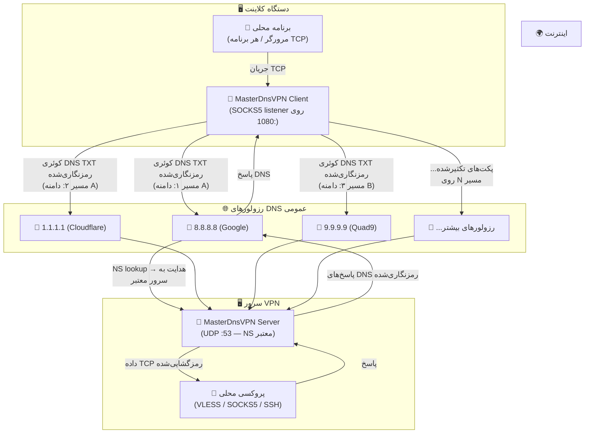
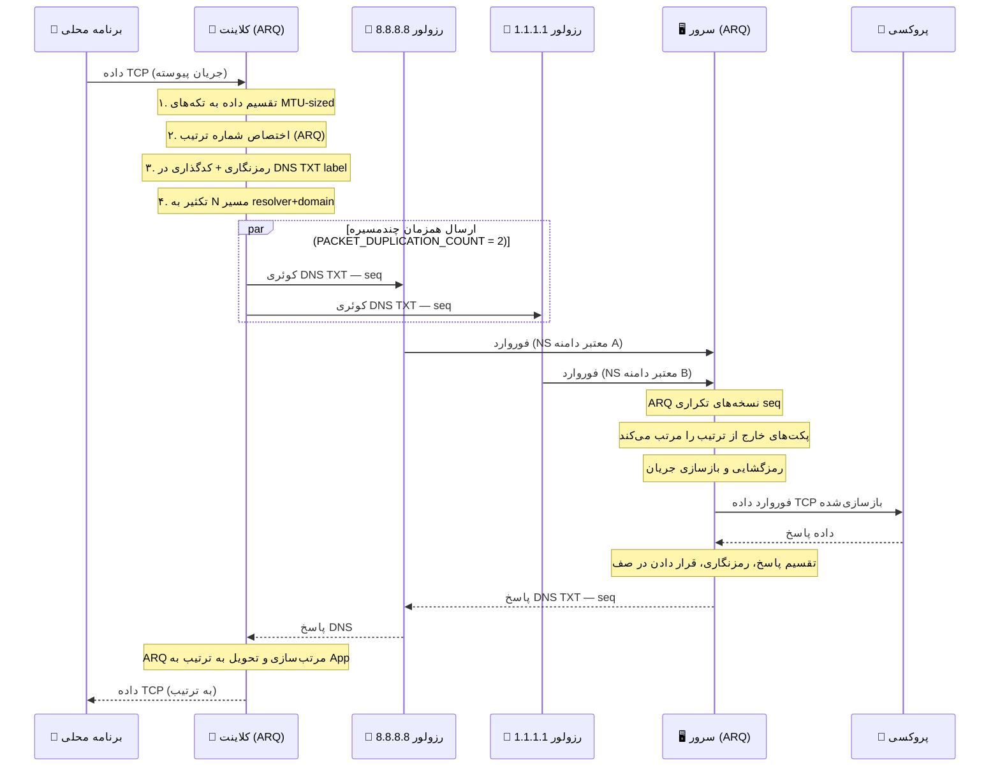

# پروژه MasterDnsVPN 🚀

## [نسخه فارسی](https://github.com/masterking32/MasterDnsVPN/blob/main/README_FA.MD) | [English Version](https://github.com/masterking32/MasterDnsVPN/blob/main/README.MD) | [Spanish Version](https://github.com/masterking32/MasterDnsVPN/blob/main/README_ES.MD)


پروژه **MasterDnsVPN** یک راهکار مقاوم، کم‌سربار و پیشرفته برای دور زدن فیلترینگ و سانسور اینترنت است که ترافیک TCP و پروتکل‌های مبتنی بر آن را به‌صورت بسته‌های رمزنگاری‌شده درون کوئری‌های DNS پنهان و منتقل می‌کند. 

این سامانه به‌طور خاص برای عبور از دیواره‌های آتش (Firewalls) سخت‌گیرانه و شرایطی طراحی شده است که روش‌های سنتی VPN، یا حتی سرویس‌های تونلینگ شناخته‌شده مانند **DNSTT** و **SlipStream** به‌دلیل اختلالات گسترده، محدودیت‌های شدید شبکه‌ای و مسدودسازی رزولورهای DNS دیگر کارآمد نیستند. 

هدف اصلی **MasterDnsVPN**، فراهم کردن تونلی امن، قابل‌اعتماد و انعطاف‌پذیر است که سربار (Overhead) پروتکل را به حداقل رسانده و در شبکه‌های دارای تلفات بسته (Packet Loss) بالا یا محدودیت‌های شدید MTU نیز عملکرد پایدار و قابل قبولی ارائه دهد.

---

## ویژگی‌های کلیدی و مزایا ✨

- **دور زدن سانسور شدید:** 🛡️ طراحی اختصاصی برای افزایش احتمال عبور از فایروال‌ها و سیاست‌های محدودکنندهٔ شبکه که پروتکل‌های VPN معمولی را مسدود می‌کنند.

- **توزیع بار و تعدد رزولورها (Load Balancing):** ⚡ پشتیبانی از چندین DNS Resolver مختلف با استراتژی‌های پیشرفتهٔ متعادل‌سازی بار بسته‌ها (شامل: انتخاب تصادفی، نوبت‌گردشی یا Round-Robin، و انتخاب بهترین رزولور بر اساس کمترین میزان تلفات).

- **تکثیر پکت چند‌مسیره (Packet Duplication):** 📡 قابلیت ارسال همزمان هر پکت از طریق چندین مسیر (رزولور و دامنهٔ مختلف). با این روش، هرکدام از پکت‌ها که زودتر به مقصد برسد پردازش می‌شود و در صورت افتادن (Drop) یک پکت در یک مسیر، همان پکت از طریق رزولور دیگر به‌سلامت می‌رسد. این تکنیک هرچند مصرف پهنای‌باند و منابع را افزایش می‌دهد، اما پایداری و اطمینان از ارسال را در شبکه‌های پر اختلال به‌شدت بالا می‌برد (این قابلیت قابل تنظیم بوده و امکان غیرفعال‌سازی آن نیز وجود دارد).

- **پروتکل ARQ سفارشی و بهینه‌سازی سربار:** 🔄 پیاده‌سازی لایهٔ بازفرست و ترتیب‌دهی بسته‌ها بر بستر UDP/DNS با استفاده از پروتکل اختصاصی ARQ به‌جای استفاده از QUIC. این کار نه‌تنها وابستگی و سربارهای اضافی QUIC را در شبکه‌های به‌شدت محدود حذف می‌کند، بلکه میزان MTU مورد نیاز را کاهش داده و با رزولورهایی که از EDNS پشتیبانی نمی‌کنند یا MTU کمتری دارند نیز کاملاً سازگار است. ساختار پکت‌ها تا حد امکان ساده شده تا کمترین دیتای سربار سمت برنامه تولید شود.

- **امنیت قوی و رمزنگاری انعطاف‌پذیر:** 🔐 پشتیبانی از روش‌های متنوع و قدرتمند رمزگذاری دیتا جهت حفظ امنیت کاربران، از جمله: `XOR`، `ChaCha20`، `AES-128-GCM`، `AES-192-GCM` و `AES-256-GCM`.

- **بررسی خودکار رزولورها و کاوش MTU:** 🧰 در هنگام اجرای برنامه، سیستم به‌صورت خودکار تمامی رزولورها را اسکن و بررسی می‌کند. این قابلیت کیفیت رزولورها را تست کرده، نتایج را به کاربر اطلاع می‌دهد و MTU بهینه را برای مسیرها تعیین می‌کند.

- **مولتی‌پلکس TCP:** 🌐 امکان مولتی‌پلکس کردن (Multiplexing) چندین اتصال محلی TCP بر روی یک نشست (Session) واحد DNS برای مدیریت بهتر منابع.

- **فشرده‌سازی و تجمیع پکت‌های کوچک:** 🗜️ در صورت نیاز و تنظیم توسط کاربر، این ویژگی امکان ادغام پکت‌های کوچک را تا اندازهٔ سقف MTU فراهم می‌کند. این کار باعث کاهش چشمگیر تعداد درخواست‌ها (Requests) شده و فضای مفید بیشتری را برای اطلاعات اصلی اختصاص می‌دهد.

- **بهینه‌سازی اختصاصی SOCKS5:** 🧦 در نسخه‌های جدید، بهینه‌سازی‌های ویژه‌ای برای پروتکل SOCKS5 صورت گرفته است. سیستم به‌صورت خودکار فورواردینگ اطلاعات را بر مبنای ساکس انجام داده و شما را از نصب سرویس‌های جانبی مانند X-UI، Dante و... بی‌نیاز می‌کند. همچنین اگر پروتکل برنامه روی SOCKS5 تنظیم شود، بخش زیادی از سربارها و پکت‌های اضافی مربوط به دست دادن (Handshake) ساکس حذف شده تا حجم درخواست‌ها و ترافیک به حداقل برسد.

- **قابلیت انتقال انواع پروتکل‌های TCP:** 🚀 علاوه بر انتقال بهینه و اختصاصی SOCKS5، شما می‌توانید ترافیک سایر سرویس‌ها نظیر `VLESS`، `ShadowSocks`، `VMESS` و سایر پروتکل‌های مبتنی بر TCP را نیز از طریق این تونل فوروارد و منتقل کنید.

---

لطفاً اگر از این پروژه استفاده می‌کنید یا به آن علاقه‌مند هستید، با دادن ستاره به ریپازیتوری از ما حمایت کنید! ⭐

---

# راه‌اندازی 🧑‍💻

## بخش ۱: پیش‌نیازهای شبکه (پیکربندی DNS) 🛠️

برای اینکه سرور شما بتواند درخواست‌های DNS را به‌طور مستقیم دریافت و پردازش کند، باید مدیریت (Delegation) یک زیردامنه را به سرور اختصاصی خودتان بسپارید. برای این کار، وارد پنل مدیریت DNS دامنهٔ خود (مانند Cloudflare، ArvanCloud و...) شوید و دقیقاً مطابق مراحل زیر دو رکورد ایجاد کنید:

### گام ۱.۱: ساخت رکورد A (معرفی IP سرور) 🅰️
ابتدا باید یک رکورد `A` بسازید تا یک زیردامنه را به آدرس IP عمومی (Public IP) سرورتان متصل کنید.
- **نوع رکورد (Type):** `A`
- **نام (Name):** یک نام کوتاه دلخواه (مثلاً `ns`)
- **آدرس (IPv4 address):** آدرس آی‌پی سرور شما (مثلاً `1.2.3.4`)
  > **نتیجه:** `ns.example.com -> 1.2.3.4`

### گام ۱.۲: ساخت رکورد NS (ارجاع زیردامنهٔ تونل) 🏷️
حالا باید یک رکورد `NS` (Name Server) ایجاد کنید. این رکورد به اینترنت می‌گوید که مسئول پاسخگویی به درخواست‌های این زیردامنه، همان سروری است که در مرحلهٔ قبل معرفی کردید. کلاینت شما از این آدرس برای برقراری ارتباط با تونل استفاده خواهد کرد.
- **نوع رکورد (Type):** `NS`
- **نام (Name):** زیردامنهٔ اصلی تونل (مثلاً `v`)
- **سرور نام (Target/Nameserver):** آدرس رکورد A که در مرحله قبل ساختید (مثلاً `ns.example.com`)
  > **نتیجه:** `v.example.com -> ns.example.com`

---

## بخش ۱.۳: اخطار بسیار مهم (مخصوص کاربران Cloudflare) ⚠️
اگر از پنل کلودفلر استفاده می‌کنید، **باید** وضعیت پروکسی (Proxy status) برای رکورد `A` روی حالت **DNS only (ابر خاکستری ☁️)** تنظیم شده باشد. اگر پروکسی روشن (ابر نارنجی) باشد، کلودفلر ترافیک UDP پورت ۵۳ را مسدود کرده و تونل شما **به‌هیچ‌وجه** کار نخواهد کرد!

## بخش ۱.۴: نکتهٔ طلایی برای افزایش سرعت (MTU) 💡
در پروتکل DNS، طول کاراکترهای دامنه بخشی از حجم محدود هر پکت را اشغال می‌کند. هرچه نام دامنه و زیردامنه‌های شما **کوتاه‌تر** باشند (مثلاً `v.ex.com` به‌جای `tunnel.my-long-domain.com`)، فضای خالی بیشتری برای انتقال داده‌های مفید (Payload) کاربر باقی می‌ماند که مستقیماً باعث افزایش پهنای باند، سرعت بالاتر و کاهش قطعی‌ها می‌شود.

---

## 📦 نیازمندی‌ها

- 🐍 پایتون 3.7 یا بالاتر
- 🔐 بستهٔ `cryptography` (برای روش‌های AES/ChaCha20 الزامی)
- 📝 بستهٔ `loguru` (برای لاگ‌گیری پیشرفته)

---

## 🚀 نصب و اجرا

### گزینه الف: دانلود فایل اجرایی آماده (پیشنهادی)

بدون نیاز به نصب پایتون، می‌توانید آخرین نسخهٔ باینری آماده را برای سیستم‌عامل خود دانلود کنید:

**دانلود کلاینت:**

| سیستم‌عامل | دانلود |
|------------|--------|
| 🪟 ویندوز (AMD64) | [MasterDnsVPN_Client_Windows_AMD64.zip](https://github.com/masterking32/MasterDnsVPN/releases/latest/download/MasterDnsVPN_Client_Windows_AMD64.zip) |
| 🐧 لینوکس (AMD64) | [MasterDnsVPN_Client_Linux_AMD64.zip](https://github.com/masterking32/MasterDnsVPN/releases/latest/download/MasterDnsVPN_Client_Linux_AMD64.zip) |
| 🐧 لینوکس (ARM64) | [MasterDnsVPN_Client_Linux_ARM64.zip](https://github.com/masterking32/MasterDnsVPN/releases/latest/download/MasterDnsVPN_Client_Linux_ARM64.zip) |
| 🍎 مک‌اواس (ARM64) | [MasterDnsVPN_Client_MacOS_ARM64.zip](https://github.com/masterking32/MasterDnsVPN/releases/latest/download/MasterDnsVPN_Client_MacOS_ARM64.zip) |

**دانلود سرور:**

| سیستم‌عامل | دانلود |
|------------|--------|
| 🪟 ویندوز (AMD64) | [MasterDnsVPN_Server_Windows_AMD64.zip](https://github.com/masterking32/MasterDnsVPN/releases/latest/download/MasterDnsVPN_Server_Windows_AMD64.zip) |
| 🐧 لینوکس (AMD64) | [MasterDnsVPN_Server_Linux_AMD64.zip](https://github.com/masterking32/MasterDnsVPN/releases/latest/download/MasterDnsVPN_Server_Linux_AMD64.zip) |
| 🐧 لینوکس (ARM64) | [MasterDnsVPN_Server_Linux_ARM64.zip](https://github.com/masterking32/MasterDnsVPN/releases/latest/download/MasterDnsVPN_Server_Linux_ARM64.zip) |
| 🍎 مک‌اواس (ARM64) | [MasterDnsVPN_Server_MacOS_ARM64.zip](https://github.com/masterking32/MasterDnsVPN/releases/latest/download/MasterDnsVPN_Server_MacOS_ARM64.zip) |

هر فایل ZIP کلاینت شامل فایل اجرایی و یک فایل قالب `client_config.toml` است. هر فایل ZIP سرور شامل فایل اجرایی و یک فایل قالب `server_config.toml` است.

**مراحل:**

1. فایل ZIP را استخراج کنید.
2. فایل `client_config.toml` را در یک ویرایشگر متنی باز کرده و مقادیر زیر را تنظیم کنید:
   - `ENCRYPTION_KEY` — از لاگ سرور در اولین اجرا کپی کنید.
   - `DOMAINS` — زیردامنهٔ تونل شما (مثلاً `v.example.com`).
   - `RESOLVER_DNS_SERVERS` — رزولورهای عمومی DNS (مثلاً `8.8.8.8`).
3. فایل `client_config.toml` را در **همان پوشه** فایل اجرایی قرار داده و برنامه را اجرا کنید.

---

### گزینه ب: اجرا از سورس

#### 1. نصب وابستگی‌ها

ریپازیتوری را کلون کرده و بسته‌های موردنیاز را نصب کنید:

```bash
git clone https://github.com/masterking32/MasterDnsVPN.git
cd MasterDnsVPN
pip install -r requirements.txt
```

#### 2. پیکربندی سرور

نمونهٔ پیکربندی را کپی کنید:

```bash
cp server_config.toml.simple server_config.toml
```

فایل `server_config.toml` را ویرایش کنید تا دامنه و آدرس/پورت فوروارد محلی را تنظیم نمایید.
- یک پروکسی محلی (مثلاً SOCKS5، VLESS، VMESS, SSH, MTProto, OpenVPN TCP و غیره) روی سرور نصب کنید تا ترافیک را به اینترنت هدایت کند.
- مقدار `FORWARD_IP` و `FORWARD_PORT` را در `server_config.toml` به آدرس پروکسی تنظیم کنید.
- مقدار `DOMAIN` را هم‌راستا با زیردامنه‌ای که در رکوردهای DNS تعریف کردید تنظیم کنید (مثلاً `v.example.com`).

#### 3. اجرای سرور

```bash
python server.py
```

در اجرای اول، سرور یک کلید رمزنگاری تولید خواهد کرد؛ این کلید را **ذخیره کنید** زیرا برای پیکربندی کلاینت لازم است.

#### 4. پیکربندی کلاینت

نمونهٔ پیکربندی کلاینت را کپی کنید:

```bash
cp client_config.toml.simple client_config.toml
```

فایل `client_config.toml` را تنظیم کنید:

- مقدار `DOMAINS`: زیردامنهٔ تونل شما (مثلاً `v.example.com`).
- مقدار `ENCRYPTION_KEY`: کلیدی که سرور در لاگ نمایش داده است.
- مقدار `RESOLVER_DNS_SERVERS`: لیست رزولورهای عمومی DNS (مثلاً `8.8.8.8`, `1.1.1.1`).

#### 5. اجرای کلاینت

```bash
python client.py
```

کلاینت یک پروکسی SOCKS5 روی `127.0.0.1:1080` راه‌اندازی می‌کند (قابل تغییر با `LISTEN_IP` و `LISTEN_PORT`). مرورگر یا برنامهٔ خود را روی این پروکسی تنظیم کنید تا ترافیک از تونل عبور کند.

---

## 🚨 نکته اضطراری: قطعی شدید شبکه

> **وقتی شبکه به طور کامل قطع است و فقط DNS کار می‌کند (اختلال و packet loss بسیار زیاد):**

1. **تا جایی که می‌توانید DNS resolver پیدا کنید** و همه را به `RESOLVER_DNS_SERVERS` در `client_config.toml` اضافه کنید. از رزولورهای عمومی Google (`8.8.8.8`، `8.8.4.4`)، Cloudflare (`1.1.1.1`، `1.0.0.1`)، Quad9 (`9.9.9.9`)، OpenDNS (`208.67.222.222`، `208.67.220.220`) و دیگران استفاده کنید.

2. **مقدار `PACKET_DUPLICATION_COUNT` را افزایش دهید.** این پارامتر تعداد مسیرهای resolver+domain مختلفی را که هر پکت **به‌طور همزمان** از آن‌ها ارسال می‌شود کنترل می‌کند.

   - با ۶ رزولور و ۲ دامنه، **۱۲ مسیر بالقوه** خواهید داشت.
   - تنظیم `PACKET_DUPLICATION_COUNT = 6` یعنی هر پکت به‌طور همزمان از ۶ مسیر مختلف ارسال می‌شود.
   - حتی اگر ۵ مسیر از ۶ مسیر fail شوند، پکت از طریق مسیر باقیمانده می‌رسد.

   > ⚠️ **هزینه:** duplication بیشتر به‌نسبت مصرف پهنای باند و CPU را افزایش می‌دهد. مقدار `3` تا `6` در زمان قطعی تعادل خوبی ایجاد می‌کند. لایه ARQ روی سرور نسخه‌های تکراری دریافت‌شده را به‌طور خودکار حذف می‌کند تا برنامه شما هر پکت را فقط یک‌بار ببیند.

3. **چندین دامنه تونل اضافه کنید** (لیست `DOMAINS`) تا تعداد مسیرهای موجود بیشتر شود.

---

## ⚙️ مرجع پیکربندی

### 🖥️ سرور — `server_config.toml`

> 🔑 کلید رمزنگاری در **اولین اجرا به‌صورت خودکار** تولید شده و در فایل `encrypt_key.txt` در کنار فایل اجرایی سرور ذخیره می‌شود. این کلید در لاگ سرور نیز نمایش داده می‌شود. آن را در فیلد `ENCRYPTION_KEY` کلاینت قرار دهید. برای چرخش کلید، فایل `encrypt_key.txt` را حذف کرده و سرور را مجدداً راه‌اندازی کنید.

| پارامتر | مقدار پیش‌فرض | توضیح |
|---------|--------------|-------|
| `LOG_LEVEL` | `"INFO"` | سطح لاگ‌گیری: `DEBUG`، `INFO`، `WARNING`، `ERROR`، `CRITICAL` |
| `UDP_HOST` | `"0.0.0.0"` | آدرس IP که سرور DNS/UDP روی آن گوش می‌دهد. `"0.0.0.0"` = همه رابط‌ها. |
| `UDP_PORT` | `53` | پورت UDP سرور DNS. پورت `53` (DNS استاندارد) نیاز به دسترسی root/admin دارد. |
| `DOMAIN` | `["t.example.com"]` | دامنه(های) تونل که سرور می‌پذیرد. باید با لیست `DOMAINS` کلاینت مطابقت داشته باشد. |
| `DATA_ENCRYPTION_METHOD` | `1` | الگوریتم رمزنگاری. **باید با کلاینت یکسان باشد.** `0`=بدون رمزنگاری، `1`=XOR، `2`=ChaCha20، `3`=AES-128-GCM، `4`=AES-192-GCM، `5`=AES-256-GCM |
| `SESSION_TIMEOUT` | `300` | مدت زمان بی‌فعالیت (ثانیه) قبل از انقضای نشست کلاینت. |
| `SESSION_CLEANUP_INTERVAL` | `60` | بازه زمانی (ثانیه) برای پاکسازی نشست‌های منقضی‌شده. |
| `FORWARD_IP` | `"127.0.0.1"` | آدرس IP پروکسی/سرویس محلی که ترافیک رمزگشایی‌شده به آن ارسال می‌شود. |
| `FORWARD_PORT` | `8080` | پورت پروکسی/سرویس محلی (مثلاً `1080` برای SOCKS5، `443` برای VLESS). |
| `ARQ_WINDOW_SIZE` | `600` | اندازه پنجره ARQ (تعداد پکت‌های بدون تأیید که می‌توانند در جریان باشند). اندازه‌های بزرگ‌تر می‌توانند عملکرد را در اتصالات با تأخیر بالا بهبود بخشند اما ممکن است مصرف حافظه را افزایش دهند. |
| `SOCKET_BUFFER_SIZE` | `8388608` (8 MB) | اندازه بافر ارسال/دریافت سوکت UDP. اگر ترافیک بالایی دارید و می‌خواهید از دست رفتن بسته‌ها به دلیل سرریز بافر جلوگیری کنید، این مقدار را افزایش دهید. |
| `MAX_CONCURRENT_REQUESTS` | `1000` | حداکثر تعداد درخواست‌های DNS همزمانی که سرور پردازش می‌کند. بر اساس بار مورد انتظار و ظرفیت سرور تنظیم کنید. |
| `ARQ_INITIAL_RTO` | `0.8` | زمان اولیه تایم‌اوت بازفرست (ثانیه) برای ARQ. بر اساس تأخیر شبکه تنظیم کنید. |
| `ARQ_MAX_RTO` | `1.5` | حداکثر زمان تایم‌اوت بازفرست (ثانیه) برای ARQ. این مقدار، backoff نمایی را محدود می‌کند تا از تأخیرهای بیش از حد جلوگیری شود. |


### 💻 کلاینت — `client_config.toml`

| پارامتر | مقدار پیش‌فرض | توضیح |
|---------|--------------|-------|
| `LOG_LEVEL` | `"INFO"` | سطح لاگ‌گیری: `DEBUG`، `INFO`، `WARNING`، `ERROR`، `CRITICAL` |
| `RESOLVER_DNS_SERVERS` | `["8.8.8.8"]` | رزولورهای عمومی DNS که کوئری‌های تونل به آن‌ها ارسال می‌شوند. برای افزایش پشتیبانی، چندین رزولور اضافه کنید. |
| `MIN_UPLOAD_MTU` | `40` | حداقل MTU آپلود (بایت) که یک رزولور باید داشته باشد. برای غیرفعال کردن `0` قرار دهید. |
| `MIN_DOWNLOAD_MTU` | `40` | حداقل MTU دانلود (بایت) که یک رزولور باید داشته باشد. برای غیرفعال کردن `0` قرار دهید. |
| `MAX_UPLOAD_MTU` | `160` | حد بالای (بایت) کاوش خودکار MTU آپلود. |
| `MAX_DOWNLOAD_MTU` | `200` | حد بالای (بایت) کاوش خودکار MTU دانلود. |
| `RESOLVER_BALANCING_STRATEGY` | `1` | استراتژی توزیع بار: `1`=تصادفی، `2`=Round-Robin، `3`=کمترین‌تلفات |
| `DOMAINS` | `["t.example.com"]` | دامنه(های) تونل که از طریق رکورد NS به سرور اشاره دارند. برای افزایش مسیرها چندین دامنه اضافه کنید. |
| `DATA_ENCRYPTION_METHOD` | `1` | الگوریتم رمزنگاری. **باید با سرور یکسان باشد.** `0`=بدون رمزنگاری، `1`=XOR، `2`=ChaCha20، `3`=AES-128-GCM، `4`=AES-192-GCM، `5`=AES-256-GCM |
| `ENCRYPTION_KEY` | `""` | کلیدی که از فایل `encrypt_key.txt` سرور یا لاگ اولین اجرا کپی می‌شود. باید با سرور یکسان باشد. |
| `DNS_QUERY_TIMEOUT` | `5` | ثانیه‌های انتظار برای دریافت پاسخ DNS قبل از در نظر گرفتن کوئری به‌عنوان ناموفق. |
| `LISTEN_IP` | `"127.0.0.1"` | آدرس IP محلی که پروکسی SOCKS5 روی آن گوش می‌دهد. |
| `LISTEN_PORT` | `1080` | پورت محلی پروکسی SOCKS5. برنامه خود را به این آدرس هدایت کنید. |
| `NUM_DNS_WORKERS` | `4` | تعداد وظایف async DNS موازی. برای ترافیک بالاتر افزایش دهید. |
| `PACKET_DUPLICATION_COUNT` | `3` | تعداد مسیرهای resolver+domain که هر پکت به‌طور همزمان از آن‌ها ارسال می‌شود. بیشتر = قابل‌اطمینان‌تر اما پهنای باند بیشتر. |
| `ARQ_WINDOW_SIZE` | `600` | اندازه پنجره ARQ (تعداد پکت‌های بدون تأیید که می‌توانند در جریان باشند). اندازه‌های بزرگ‌تر می‌توانند عملکرد را در اتصالات با تأخیر بالا بهبود بخشند اما ممکن است مصرف حافظه را افزایش دهند. |
| `SOCKET_BUFFER_SIZE` | `8388608` (8 MB) | اندازه بافر ارسال/دریافت سوکت UDP. اگر ترافیک بالایی دارید و می‌خواهید از دست رفتن بسته‌ها به دلیل سرریز بافر جلوگیری کنید، این مقدار را افزایش دهید. |
| `ARQ_INITIAL_RTO` | `0.8` | زمان اولیه تایم‌اوت بازفرست (ثانیه) برای ARQ. بر اساس تأخیر شبکه تنظیم کنید. |
| `ARQ_MAX_RTO` | `1.5` | حداکثر زمان تایم‌اوت بازفرست (ثانیه) برای ARQ. این مقدار، backoff نمایی را محدود می‌کند تا از تأخیرهای بیش از حد جلوگیری شود. |
| `NUM_RX_WORKERS` | `2` | تعداد وظایف async که بسته‌های دریافتی را پردازش می‌کنند. برای ترافیک بالاتر افزایش دهید. |
| `MAX_CONNECTION_ATTEMPTS` | `10` | حداکثر تعداد تلاش‌های اتصال قبل از تسلیم شدن. بر اساس قابلیت اطمینان شبکه تنظیم کنید. |


---

## 🛑 رفع مشکلات: پورت ۵۳ در حال استفاده (لینوکس)

در بسیاری از توزیع‌های لینوکس (مانند اوبونتو)، پورت ۵۳ قبلاً توسط systemd-resolved استفاده می‌شود. اگر سرور به دلیل تداخل پورت راه‌اندازی نشد، باید شنونده پیش‌فرض DNS stub را غیرفعال کنید:

- ویرایش تنظیمات: `sudo nano /etc/systemd/resolved.conf`
- خط را از حالت کامنت خارج کرده و تغییر دهید به: `DNSStubListener=no`
- سرویس را مجدداً راه‌اندازی کنید: `sudo systemctl restart systemd-resolved`

(اختیاری) به‌روزرسانی **resolv.conf**: `sudo ln -sf /run/systemd/resolve/resolv.conf /etc/resolv.conf`

---

## ⚙️ اجرای به‌عنوان سرویس پس‌زمینه (Systemd)

برای محیط‌های تولید، توصیه می‌شود سرور را به‌عنوان یک سرویس پس‌زمینه اجرا کنید تا به‌طور خودکار هنگام بوت سیستم شروع شود.

- ایجاد فایل سرویس: `sudo nano /etc/systemd/system/masterdnsvpn.service`
- پیکربندی زیر را جای‌گذاری کنید (مسیر `/path/to/` را تنظیم کنید)

```ini
[Unit]
Description=MasterDnsVPN Server
After=network.target

[Service]
Type=simple
WorkingDirectory=/path/to/MasterDnsVPN
ExecStart=/usr/bin/python3 server.py
Restart=on-failure
User=root

[Install]
WantedBy=multi-user.target

```
- ذخیره و خروج. سپس سرویس را فعال و راه‌اندازی کنید:

```bash
sudo systemctl daemon-reload
sudo systemctl enable masterdnsvpn
sudo systemctl start masterdnsvpn
sudo systemctl status masterdnsvpn
```

## 🛠️ نحوهٔ کار

### معماری سیستم



### جریان پکت (نمودار توالی)



### مفاهیم کلیدی

| مفهوم | توضیح |
|---|---|
| **Session** | یک اتصال کلاینت؛ حداکثر ۲۵۵ نشست همزمان در هر سرور |
| **Stream** | یک اتصال TCP که روی یک session مولتی‌پلکس شده |
| **MTU Probing** | جستجوی دودویی در شروع برای یافتن حداکثر اندازه payload DNS در مسیر شما |
| **ARQ** | شماره ترتیب + بازارسال تضمین می‌کند که هیچ داده‌ای روی UDP/DNS از دست نرود |
| **PACKET_DUPLICATION_COUNT** | هر پکت به‌طور همزمان از این تعداد مسیر resolver+domain ارسال می‌شود |
| **Resolver Balancing** | استراتژی‌ها: تصادفی (1)، Round-Robin (2)، کمترین‌تلفات (3) |

---

## 📝 نکات فنی

- ⚡ **بهینه‌سازی MTU:** هنگام اتصال، کلاینت با روش جستجوی دودویی حداکثر MTU قابل‌انتقال در مسیر را پیدا می‌کند تا حداکثر سرعت بدون قطعه‌قطعه شدن بسته‌ها فراهم شود.

- 🔄 **پولینگ تطبیقی:** کلاینت از سازوکارهای عقب‌نشینی هوشمند و بررسی بیکار بودن برای کاهش بار DNS هنگام عدم انتقال داده استفاده می‌کند.

- 🔒 **رمزنگاری:** برای روش‌های AES/ChaCha20 بستهٔ `cryptography` ضروری است. برای دستگاه‌های کم‌منابع، روش XOR (Method 1) پیشنهاد می‌شود.

- 🔁 **چند سرور همزمان:** می‌توانید چندین instance مستقل از MasterDnsVPN Server با دامنه‌های مختلف راه‌اندازی کنید و همه دامنه‌ها را در آرایه `DOMAINS` کلاینت قرار دهید. کلاینت هر ترکیب دامنه+رزولور را به‌عنوان یک مسیر جداگانه در نظر می‌گیرد و ترافیک را به‌طور خودکار در همه آن‌ها توزیع و تکثیر می‌کند.

---

## 🤝 مشارکت
مشارکت‌ها خوش‌آمد گفته می‌شود! لطفاً فورک کنید و تغییرات خود را با یک Pull Request ارسال کنید.

---

## 📄 مجوز
این پروژه تحت مجوز MIT منتشر شده است. برای جزئیات به فایل LICENSE مراجعه کنید.

---

## 👨‍💻 توسعه‌دهنده
توسعه‌دهنده: [MasterkinG32](https://github.com/masterking32)
