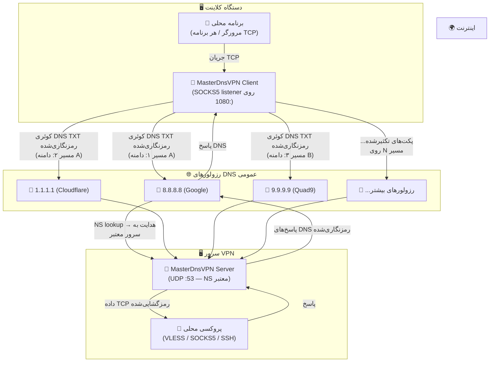
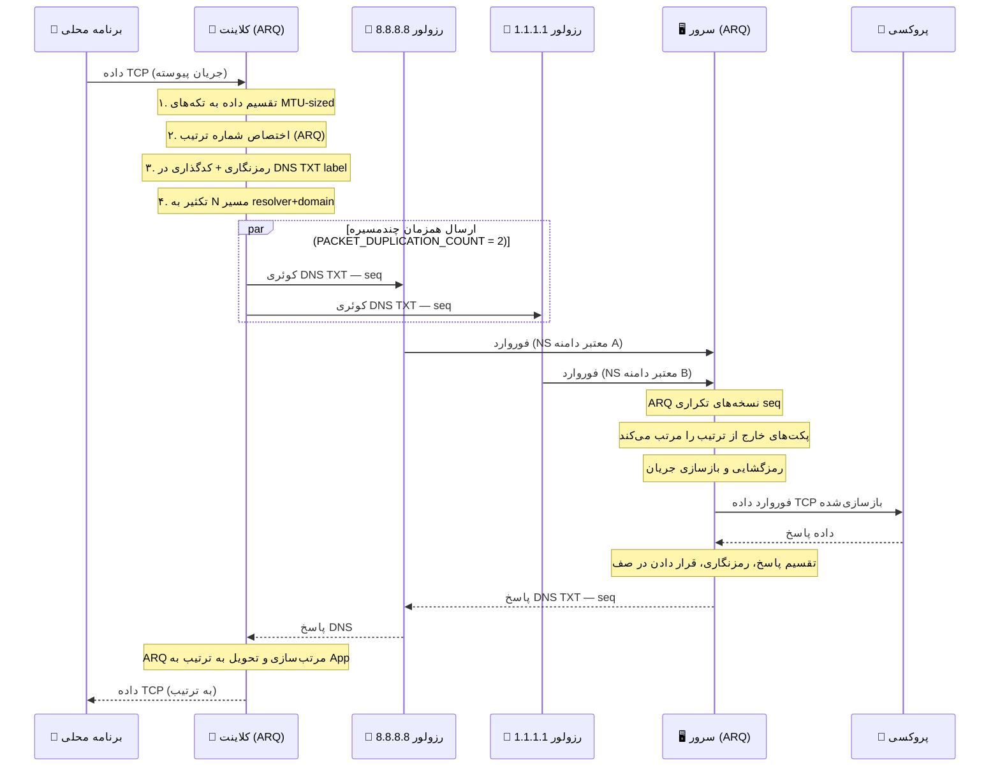

# 🚀 MasterDnsVPN

## [نسخه فارسی](https://github.com/masterking32/MasterDnsVPN/blob/main/README_FA.MD) | [English Version](https://github.com/masterking32/MasterDnsVPN/blob/main/README.MD) | [Spanish Version](https://github.com/masterking32/MasterDnsVPN/blob/main/README_ES.MD)

پروژه MasterDnsVPN یک ابزار تونل‌زنی DNS با کارایی بالا است که برای محصورسازی ترافیک VPN درون پرس‌وجوهای DNS طراحی شده است. این پروژه به‌خصوص برای عبور از سانسور شبکه و دیواره‌های آتش سخت‌گیرانه که پروتکل‌های معمول VPN مسدود می‌شوند، ساخته شده است.

این پروژه دارای پیاده‌سازی سفارشی **ARQ (درخواست تکرار خودکار)** است که قابلیت اطمینان شبیه TCP و ترتیب‌دهی بسته‌ها را روی پروتکل DNS که مبتنی بر UDP و به‌طور ذاتی غیرقابل‌اعتماد است، فراهم می‌کند.

---

⭐ اگر از این پروژه استفاده می‌کنید یا به آن علاقه‌مند هستید، لطفاً با دادن ستاره به ریپازیتوری حمایت کنید! ⭐

---

## ✨ ویژگی‌های کلیدی
- 🛡️ **دور زدن سانسور:** استفاده از پروتکل DNS برای تونل‌سازی ترافیک در محیط‌های محدود.
- 🔐 **امنیت قوی:** پشتیبانی از روش‌های رمزگذاری مختلف از جمله XOR، ChaCha20، AES-128-CTR، AES-192-CTR و AES-256-CTR.
- ⚙️ **مدیریت هوشمند MTU:** سنجش و همگام‌سازی خودکار حداکثر واحد انتقال (MTU) برای آپلود و دانلود.
- 🔄 **پروتکل ARQ سفارشی:** حل مشکل از دست رفتن بسته‌ها و تحویل خارج از ترتیب با بازارسال پویا و کنترل جریان.
- ⚡ **توزیع بار رزولورها:** پشتیبانی از چندین رزولور DNS با استراتژی‌های متعادل‌سازی (تصادفی، دورانی، بهترین بر اساس تلفات).
- 🌐 **مولتی‌پلکس TCP:** چندین اتصال محلی TCP را می‌توان روی یک نشست DNS واحد مولتی‌پلکس کرد.
- 📡 **تکثیر پکت چند‌مسیره:** هر پکت می‌تواند به‌طور همزمان از چندین مسیر resolver+domain ارسال شود تا در شرایط قطعی شدید شبکه بیشترین اطمینان حاصل شود.

---

## 🛠️ پیش‌نیازهای شبکه (پیکربندی DNS)

برای کارکرد تونل باید مالک یک دامنه باشید و رکوردهای زیر را در پنل مدیریت DNS خود (مثلاً Cloudflare) تنظیم کنید:

1. **ریکورد A:** یک رکورد `A` بسازید که به IP عمومی سرور شما اشاره کند.
   - مثال: `s.example.com` -> `1.2.3.4`
2. **ریکورد NS:** یک رکورد `NS` برای زیردامنهٔ تونل بسازید که به رکورد `A` اشاره کند.
   - مثال: `v.example.com` -> `s.example.com`

> 💡 **نکته:** هرچه نام دامنه و زیردامنه کوتاه‌تر باشد (مثلاً `v.ex.com`) فضای بیشتری برای داده‌های مفید در هر بسته DNS باقی می‌ماند و توان عملیاتی افزایش می‌یابد.

---

## 📦 نیازمندی‌ها

- 🐍 پایتون 3.7 یا بالاتر
- 🔐 بستهٔ `cryptography` (برای روش‌های AES/ChaCha20 الزامی)
- 📝 بستهٔ `loguru` (برای لاگ‌گیری پیشرفته)

---

## 🚀 نصب و اجرا

### گزینه الف: دانلود فایل اجرایی آماده (پیشنهادی)

بدون نیاز به نصب پایتون، می‌توانید آخرین نسخهٔ باینری آماده را برای سیستم‌عامل خود دانلود کنید:

**دانلود کلاینت:**

| سیستم‌عامل | دانلود |
|------------|--------|
| 🪟 ویندوز (AMD64) | [MasterDnsVPN_Client_Windows_AMD64.zip](https://github.com/masterking32/MasterDnsVPN/releases/latest/download/MasterDnsVPN_Client_Windows_AMD64.zip) |
| 🐧 لینوکس (AMD64) | [MasterDnsVPN_Client_Linux_AMD64.zip](https://github.com/masterking32/MasterDnsVPN/releases/latest/download/MasterDnsVPN_Client_Linux_AMD64.zip) |
| 🍎 مک‌اواس (ARM64) | [MasterDnsVPN_Client_MacOS_ARM64.zip](https://github.com/masterking32/MasterDnsVPN/releases/latest/download/MasterDnsVPN_Client_MacOS_ARM64.zip) |

**دانلود سرور:**

| سیستم‌عامل | دانلود |
|------------|--------|
| 🪟 ویندوز (AMD64) | [MasterDnsVPN_Server_Windows_AMD64.zip](https://github.com/masterking32/MasterDnsVPN/releases/latest/download/MasterDnsVPN_Server_Windows_AMD64.zip) |
| 🐧 لینوکس (AMD64) | [MasterDnsVPN_Server_Linux_AMD64.zip](https://github.com/masterking32/MasterDnsVPN/releases/latest/download/MasterDnsVPN_Server_Linux_AMD64.zip) |
| 🍎 مک‌اواس (ARM64) | [MasterDnsVPN_Server_MacOS_ARM64.zip](https://github.com/masterking32/MasterDnsVPN/releases/latest/download/MasterDnsVPN_Server_MacOS_ARM64.zip) |

هر فایل ZIP کلاینت شامل فایل اجرایی و یک فایل قالب `client_config.toml` است. هر فایل ZIP سرور شامل فایل اجرایی و یک فایل قالب `server_config.toml` است.

**مراحل:**

1. فایل ZIP را استخراج کنید.
2. فایل `client_config.toml` را در یک ویرایشگر متنی باز کرده و مقادیر زیر را تنظیم کنید:
   - `ENCRYPTION_KEY` — از لاگ سرور در اولین اجرا کپی کنید.
   - `DOMAINS` — زیردامنهٔ تونل شما (مثلاً `v.example.com`).
   - `RESOLVER_DNS_SERVERS` — رزولورهای عمومی DNS (مثلاً `8.8.8.8`).
3. فایل `client_config.toml` را در **همان پوشه** فایل اجرایی قرار داده و برنامه را اجرا کنید.

---

### گزینه ب: اجرا از سورس

#### 1. نصب وابستگی‌ها

ریپازیتوری را کلون کرده و بسته‌های موردنیاز را نصب کنید:

```bash
git clone https://github.com/masterking32/MasterDnsVPN.git
cd MasterDnsVPN
pip install -r requirements.txt
```

#### 2. پیکربندی سرور

نمونهٔ پیکربندی را کپی کنید:

```bash
cp server_config.toml.simple server_config.toml
```

فایل `server_config.toml` را ویرایش کنید تا دامنه و آدرس/پورت فوروارد محلی را تنظیم نمایید.
- یک پروکسی محلی (مثلاً SOCKS5، VLESS، VMESS, SSH, MTProto, OpenVPN TCP و غیره) روی سرور نصب کنید تا ترافیک را به اینترنت هدایت کند.
- مقدار `FORWARD_IP` و `FORWARD_PORT` را در `server_config.toml` به آدرس پروکسی تنظیم کنید.
- مقدار `DOMAIN` را هم‌راستا با زیردامنه‌ای که در رکوردهای DNS تعریف کردید تنظیم کنید (مثلاً `v.example.com`).

#### 3. اجرای سرور

```bash
python server.py
```

در اجرای اول، سرور یک کلید رمزنگاری تولید خواهد کرد؛ این کلید را **ذخیره کنید** زیرا برای پیکربندی کلاینت لازم است.

#### 4. پیکربندی کلاینت

نمونهٔ پیکربندی کلاینت را کپی کنید:

```bash
cp client_config.toml.simple client_config.toml
```

فایل `client_config.toml` را تنظیم کنید:

- مقدار `DOMAINS`: زیردامنهٔ تونل شما (مثلاً `v.example.com`).
- مقدار `ENCRYPTION_KEY`: کلیدی که سرور در لاگ نمایش داده است.
- مقدار `RESOLVER_DNS_SERVERS`: لیست رزولورهای عمومی DNS (مثلاً `8.8.8.8`, `1.1.1.1`).

#### 5. اجرای کلاینت

```bash
python client.py
```

کلاینت یک پروکسی SOCKS5 روی `127.0.0.1:1080` راه‌اندازی می‌کند (قابل تغییر با `LISTEN_IP` و `LISTEN_PORT`). مرورگر یا برنامهٔ خود را روی این پروکسی تنظیم کنید تا ترافیک از تونل عبور کند.

---

## 🚨 نکته اضطراری: قطعی شدید شبکه

> **وقتی شبکه به طور کامل قطع است و فقط DNS کار می‌کند (اختلال و packet loss بسیار زیاد):**

1. **تا جایی که می‌توانید DNS resolver پیدا کنید** و همه را به `RESOLVER_DNS_SERVERS` در `client_config.toml` اضافه کنید. از رزولورهای عمومی Google (`8.8.8.8`، `8.8.4.4`)، Cloudflare (`1.1.1.1`، `1.0.0.1`)، Quad9 (`9.9.9.9`)، OpenDNS (`208.67.222.222`، `208.67.220.220`) و دیگران استفاده کنید.

2. **مقدار `PACKET_DUPLICATION_COUNT` را افزایش دهید.** این پارامتر تعداد مسیرهای resolver+domain مختلفی را که هر پکت **به‌طور همزمان** از آن‌ها ارسال می‌شود کنترل می‌کند.

   - با ۶ رزولور و ۲ دامنه، **۱۲ مسیر بالقوه** خواهید داشت.
   - تنظیم `PACKET_DUPLICATION_COUNT = 6` یعنی هر پکت به‌طور همزمان از ۶ مسیر مختلف ارسال می‌شود.
   - حتی اگر ۵ مسیر از ۶ مسیر fail شوند، پکت از طریق مسیر باقیمانده می‌رسد.

   > ⚠️ **هزینه:** duplication بیشتر به‌نسبت مصرف پهنای باند و CPU را افزایش می‌دهد. مقدار `3` تا `6` در زمان قطعی تعادل خوبی ایجاد می‌کند. لایه ARQ روی سرور نسخه‌های تکراری دریافت‌شده را به‌طور خودکار حذف می‌کند تا برنامه شما هر پکت را فقط یک‌بار ببیند.

3. **چندین دامنه تونل اضافه کنید** (لیست `DOMAINS`) تا تعداد مسیرهای موجود بیشتر شود.

---

## ⚙️ مرجع پیکربندی

### 🖥️ سرور — `server_config.toml`

> 🔑 کلید رمزنگاری در **اولین اجرا به‌صورت خودکار** تولید شده و در فایل `encrypt_key.txt` در کنار فایل اجرایی سرور ذخیره می‌شود. این کلید در لاگ سرور نیز نمایش داده می‌شود. آن را در فیلد `ENCRYPTION_KEY` کلاینت قرار دهید. برای چرخش کلید، فایل `encrypt_key.txt` را حذف کرده و سرور را مجدداً راه‌اندازی کنید.

| پارامتر | مقدار پیش‌فرض | توضیح |
|---------|--------------|-------|
| `LOG_LEVEL` | `"INFO"` | سطح لاگ‌گیری: `DEBUG`، `INFO`، `WARNING`، `ERROR`، `CRITICAL` |
| `UDP_HOST` | `"0.0.0.0"` | آدرس IP که سرور DNS/UDP روی آن گوش می‌دهد. `"0.0.0.0"` = همه رابط‌ها. |
| `UDP_PORT` | `53` | پورت UDP سرور DNS. پورت `53` (DNS استاندارد) نیاز به دسترسی root/admin دارد. |
| `DOMAIN` | `["t.example.com"]` | دامنه(های) تونل که سرور می‌پذیرد. باید با لیست `DOMAINS` کلاینت مطابقت داشته باشد. |
| `DATA_ENCRYPTION_METHOD` | `1` | الگوریتم رمزنگاری. **باید با کلاینت یکسان باشد.** `0`=بدون رمزنگاری، `1`=XOR، `2`=ChaCha20، `3`=AES-128-CTR، `4`=AES-192-CTR، `5`=AES-256-CTR |
| `SESSION_TIMEOUT` | `300` | مدت زمان بی‌فعالیت (ثانیه) قبل از انقضای نشست کلاینت. |
| `SESSION_CLEANUP_INTERVAL` | `60` | بازه زمانی (ثانیه) برای پاکسازی نشست‌های منقضی‌شده. |
| `FORWARD_IP` | `"127.0.0.1"` | آدرس IP پروکسی/سرویس محلی که ترافیک رمزگشایی‌شده به آن ارسال می‌شود. |
| `FORWARD_PORT` | `8080` | پورت پروکسی/سرویس محلی (مثلاً `1080` برای SOCKS5، `443` برای VLESS). |

### 💻 کلاینت — `client_config.toml`

| پارامتر | مقدار پیش‌فرض | توضیح |
|---------|--------------|-------|
| `LOG_LEVEL` | `"INFO"` | سطح لاگ‌گیری: `DEBUG`، `INFO`، `WARNING`، `ERROR`، `CRITICAL` |
| `RESOLVER_DNS_SERVERS` | `["8.8.8.8"]` | رزولورهای عمومی DNS که کوئری‌های تونل به آن‌ها ارسال می‌شوند. برای افزایش پشتیبانی، چندین رزولور اضافه کنید. |
| `MIN_UPLOAD_MTU` | `40` | حداقل MTU آپلود (بایت) که یک رزولور باید داشته باشد. برای غیرفعال کردن `0` قرار دهید. |
| `MIN_DOWNLOAD_MTU` | `40` | حداقل MTU دانلود (بایت) که یک رزولور باید داشته باشد. برای غیرفعال کردن `0` قرار دهید. |
| `MAX_UPLOAD_MTU` | `160` | حد بالای (بایت) کاوش خودکار MTU آپلود. |
| `MAX_DOWNLOAD_MTU` | `200` | حد بالای (بایت) کاوش خودکار MTU دانلود. |
| `RESOLVER_BALANCING_STRATEGY` | `1` | استراتژی توزیع بار: `1`=تصادفی، `2`=Round-Robin، `3`=کمترین‌تلفات |
| `DOMAINS` | `["t.example.com"]` | دامنه(های) تونل که از طریق رکورد NS به سرور اشاره دارند. برای افزایش مسیرها چندین دامنه اضافه کنید. |
| `DATA_ENCRYPTION_METHOD` | `1` | الگوریتم رمزنگاری. **باید با سرور یکسان باشد.** `0`=بدون رمزنگاری، `1`=XOR، `2`=ChaCha20، `3`=AES-128-CTR، `4`=AES-192-CTR، `5`=AES-256-CTR |
| `ENCRYPTION_KEY` | `""` | کلیدی که از فایل `encrypt_key.txt` سرور یا لاگ اولین اجرا کپی می‌شود. باید با سرور یکسان باشد. |
| `DNS_QUERY_TIMEOUT` | `5` | ثانیه‌های انتظار برای دریافت پاسخ DNS قبل از در نظر گرفتن کوئری به‌عنوان ناموفق. |
| `LISTEN_IP` | `"127.0.0.1"` | آدرس IP محلی که پروکسی SOCKS5 روی آن گوش می‌دهد. |
| `LISTEN_PORT` | `1080` | پورت محلی پروکسی SOCKS5. برنامه خود را به این آدرس هدایت کنید. |
| `NUM_DNS_WORKERS` | `4` | تعداد وظایف async DNS موازی. برای ترافیک بالاتر افزایش دهید. |
| `PACKET_DUPLICATION_COUNT` | `3` | تعداد مسیرهای resolver+domain که هر پکت به‌طور همزمان از آن‌ها ارسال می‌شود. بیشتر = قابل‌اطمینان‌تر اما پهنای باند بیشتر. |

---

## 🛠️ نحوهٔ کار

### معماری سیستم



### جریان پکت (نمودار توالی)



### مفاهیم کلیدی

| مفهوم | توضیح |
|---|---|
| **Session** | یک اتصال کلاینت؛ حداکثر ۲۵۵ نشست همزمان در هر سرور |
| **Stream** | یک اتصال TCP که روی یک session مولتی‌پلکس شده |
| **MTU Probing** | جستجوی دودویی در شروع برای یافتن حداکثر اندازه payload DNS در مسیر شما |
| **ARQ** | شماره ترتیب + بازارسال تضمین می‌کند که هیچ داده‌ای روی UDP/DNS از دست نرود |
| **PACKET_DUPLICATION_COUNT** | هر پکت به‌طور همزمان از این تعداد مسیر resolver+domain ارسال می‌شود |
| **Resolver Balancing** | استراتژی‌ها: تصادفی (1)، Round-Robin (2)، کمترین‌تلفات (3) |

---

## 📝 نکات فنی

- ⚡ **بهینه‌سازی MTU:** هنگام اتصال، کلاینت با روش جستجوی دودویی حداکثر MTU قابل‌انتقال در مسیر را پیدا می‌کند تا حداکثر سرعت بدون قطعه‌قطعه شدن بسته‌ها فراهم شود.

- 🔄 **پولینگ تطبیقی:** کلاینت از سازوکارهای عقب‌نشینی هوشمند و بررسی بیکار بودن برای کاهش بار DNS هنگام عدم انتقال داده استفاده می‌کند.

- 🔒 **رمزنگاری:** برای روش‌های AES/ChaCha20 بستهٔ `cryptography` ضروری است. برای دستگاه‌های کم‌منابع، روش XOR (Method 1) پیشنهاد می‌شود.

- 🔁 **چند سرور همزمان:** می‌توانید چندین instance مستقل از MasterDnsVPN Server با دامنه‌های مختلف راه‌اندازی کنید و همه دامنه‌ها را در آرایه `DOMAINS` کلاینت قرار دهید. کلاینت هر ترکیب دامنه+رزولور را به‌عنوان یک مسیر جداگانه در نظر می‌گیرد و ترافیک را به‌طور خودکار در همه آن‌ها توزیع و تکثیر می‌کند.

---

## 🤝 مشارکت
مشارکت‌ها خوش‌آمد گفته می‌شود! لطفاً فورک کنید و تغییرات خود را با یک Pull Request ارسال کنید.

---

## 📄 مجوز
این پروژه تحت مجوز MIT منتشر شده است. برای جزئیات به فایل LICENSE مراجعه کنید.

---

## 👨‍💻 توسعه‌دهنده
توسعه‌دهنده: [MasterkinG32](https://github.com/masterking32)
